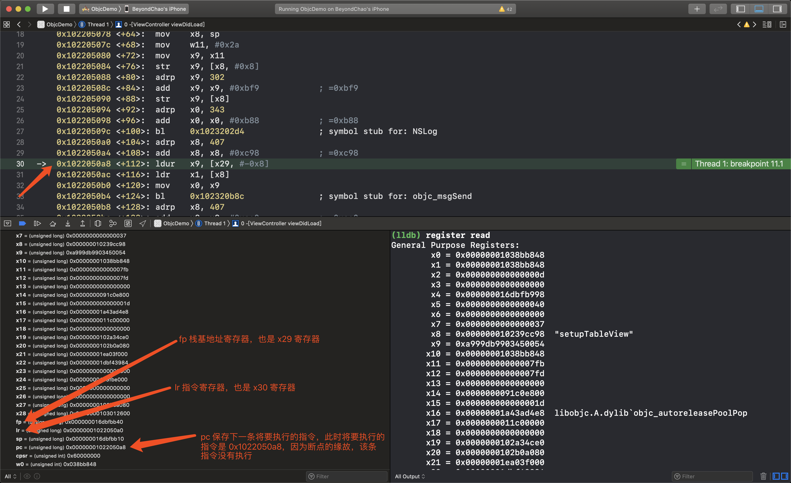
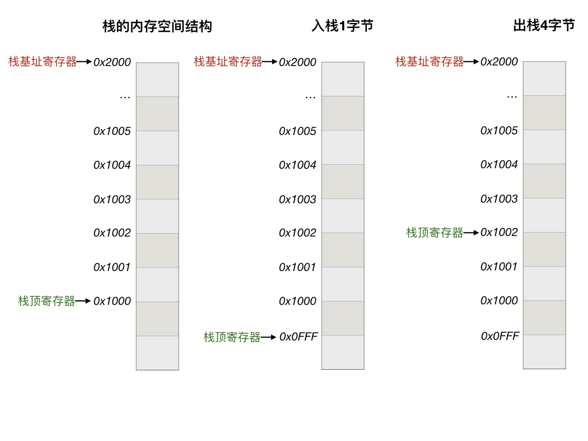
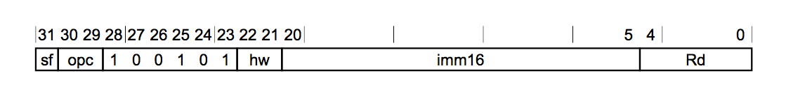

# AssemblyJourney
ARM64 architecture instruction 

arm64 汇编菜鸟的私房菜。

---

## Generate assembly code

```
clang -S -arch arm64 -isysroot `xcrun --sdk iphoneos --show-sdk-path` YOUR_SOURCE_FILE.c -o ./asm/YOUR_ASSEMBLY_FILE.s

```

* -arch 指定架构平台
* -isysroot 指定SDK 的目录（include 头文件所在库的位置），由 xcrun 生成的目录

---

## Register

|  寄存器   |   说明    |
|  --------   | --------  |
| **PC**  |  Program Counter 指令寄存器(程序计数器)，保存的是下一条将要执行的指令的内存地址，而不是当前正在执行的指令的内存地址。|
| **LR**  |  Link Register 寄存器则保存着最后一次函数调用指令的下一条指令的内存地址，为了做函数调用栈跟踪，我们的程序在崩溃时能够将函数调用栈打印出来就是借助了LR寄存器来实现的，在iOS 也就是 **X30 寄存器** |
| **SP** | Stack Pointer register **栈寄存器**，维护一个栈，需要两个寄存器，一个保存栈的基地址，也是**栈顶地址**，一个保存栈的偏移地址，即**栈底地址**，**在 arm64 中用 X29(FP) 寄存器保存栈的基地址，SP 寄存器 保存栈顶地址，它是可以移动的，所以我们看到函数的调用时候，通常第一句 都是 sub	sp, sp, #immediate，开辟栈空间，函数调用结束，add	sp, sp, #immediate，回复栈空间，这也是为什么，栈内存能够自动回收的原因** |
| **X0-X30** | **数据地址寄存器**通常用来做数据计算的临时存储、做累加、计数、地址保存等功能, 对应的32位是**W0-W30** |
| **XZR** | 用来保存 0，它的 32 位是 **WZR**，一般定义一个变量，初始化为 0 时就会用到它 |
| **D0-D31** | **浮点寄存器**，因为浮点数的存储以及其运算的特殊性，所以CPU中专门提供FPU以及相应的浮点数寄存器来处理浮点数，对应的 32位是 **S0 - S31** |
| **V0-V31** | 现在的CPU除了支持标量运算外，还支持向量运算。向量运算在图形处理相关的领域用得非常的多。为了支持向量计算系统了也提供了众多的**向量寄存器**|
|**CPSR**| **状态寄存器**，1. 保存指令执行过程中的结果，比如相加的结果是否溢出、结果是否为0、以及是否是负数等。2. 一些指令的执行需要根据状态寄存器的值进行处理，比如一些条件跳转指令或者比较指令等|

**注意：**
> arm64体系的CPU中虽然定义X29,X30两个寄存器，但是你在 Xcode 上是看不到这两个寄存器的，但是你能到FP和LR寄存器，其实X29就是FP, X30就是LR。

**Xcode** 查看真机上的寄存器如图：



栈结构图：




--- 

## Instructions
常用指令介绍

|  指令     | 使用示例    | 说明 |
|  --------   | --------  | ------- | 
| **stp**  |  sub sp, sp, #32 <br> stp x29, x30, [sp, #16] | stp: Store Pair of Registers 把一对寄存器中的内容保存起来。<br>通常是保存到栈上或内存中，这里是把 FP LR 保存到sp 偏移16字节的位置上。<br> 这两句一般出现在函数的开头，用于开辟栈空间，保存现场，因为寄存器在CPU中只有一个，调用别的函数时也需要使用的。<br> 所以先把相关寄存器的内容保存到栈内存中，当执行完毕后，从栈中 **ldp** 加载之前保存的内容到寄存器中，恢复现场，**ret** 就是把 LR 内容赋值给 PC |
|**adrp**|  adrp x0, l_.str@PAGE  <br> add x0, x0, l_.str@PAGEOFF <br> bl	_printf | 获取某个标签所在页的地址，这里的label 是 l_.str，@PAGE 表示该标签所在的页 <br> @PAGEOFF 表示该标签地址对应页地址的偏移<br>这样 add 之后 就可以获取某个标签具体的地址了（保存着字符串常量），把计算结果存入**x0 寄存器**，然后调用 printf 打印出来，因为 x0 保存的是函数调用的第一个参数。|
| | |


> 1. 更多指令详解介绍，参照 arm64(armV8) [指令手册](media/DDI_0596_ARM_a64_instruction_set_architecture.pdf)，[armasm 用户指南](media/DUI0801I_armasm_user_guide.pdf)，方便查阅。 <br>
> 2. armasm: The  ARM  Assembler  compiles  ARM  Assembly Language into
       object code in ARM Object Format
> 3. [arm官网文档](http://infocenter.arm.com/help/index.jsp?topic=/com.arm.doc.dui0802a/a64_general_instructions.html)


---


## Instruction encodings

我们知道机器指令是二进制数据，最终一条指令（汇编指令）被翻译成机器码才能执行的，一条机器指令里面无论是操作码还是操作数都是二进制编码的，二进制数据太过晦涩难以理解，所以才有了汇编语言的诞生，汇编语言是一种机器指令的助记语言，他只不过是以人类更容易理解的自然语言的方式来描述一条机器指令而已。所以虽然上面的寄存器看到的是一个个字母，但是在机器语言里面，则是通过给寄存器编号来表示某个寄存器的


```
汇编指令与其对应的机器码：

mov x0, #0x0     ;0xD2800000  
mov x1, #0x0     ;0xD2800001
mov x2, #0x0     ;0xD2800002

```

mov 指令编码为


* Rd 段表示寄存器的编码，CPU 在访问寄存器的时候，就是根据这个段来标识要访问那个寄存器，理解为寄存器的地址，和CPU 访问内存单元类似
* imm16 段表示要操作的立即数
* hw 段
* sf 段
* opc 段表示 操作码


---

## Reference
* https://zhuanlan.zhihu.com/p/31168191
* https://www.jianshu.com/p/f649285668cd
* https://www.jianshu.com/p/6d7a57794122